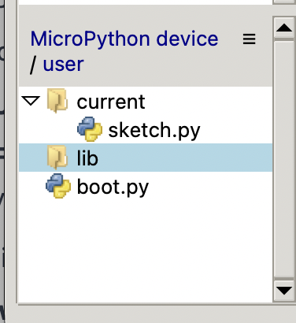
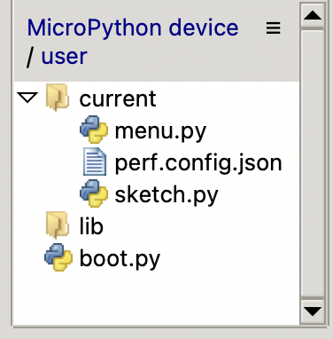

# AMYboard Eurorack Menu

A MicroPython menu system for the AMYboard Eurorack module, adding hands-on 
voice selection and CV assignment via OLED display and rotary encoder — 
no laptop required during performance.

> 📺 **See it in action:** [YouTube Demo](https://youtu.be/oOmmAvbUHY0)

## What it does

- Browse and select from all 256 AMYboard stock voices via OLED display and rotary encoder
- Assign CV 1 and CV 2 inputs for v/oct and gate control
- Designed for live Eurorack performance

Built by a modular musician who needed this for their own setup. If you 
have an AMYboard in a Eurorack case and want hands-on control without a 
computer, this is for you.

> ⚠️ **Work in progress** — core voice selection and CV assignment are 
> working. Additional features in development — see the roadmap below.

## Roadmap

### ✅ Current (v0.1)

- 256 stock voice selection via rotary encoder
- CV 1/2 input assignment (v/oct and gate)
- OLED menu navigation

### 🔄 In Progress

- Menu-level MIDI configuration and performance controls
- Voice allocation logic for use with polyphonic sequencers

### 📋 Planned

- Performance mode with real time parameter control
- Additional CV routing options
- Extended voice customisation

### 💡 Future Ideas

- Deeper sequencer midi integration
- Preset save and recall
- Additional display layouts

## Features

- **Navigable Menu Interface**: Intuitive hierarchical menu system for synthesizer parameter configuration
- **Multiple Input Drivers**: Support for various input backends including:
  - MIDI (via UART)
  - Adafruit Seesaw encoder (I2C)
  - Adafruit Twist controller (I2C)
  - Computer keyboard/stdin (for testing)
  - Hardware automation (demo mode)
  - Hybrid mode (combine multiple drivers)
- **Patch Profile Management**: Save and load complete synthesizer configurations
- **CV Control**: Real-time CV input handling for:
  - Pitch control (1V/octave default, configurable)
  - Gate/trigger input (adjustable threshold)
  - Macro mapping for modulation control
- **Display Support**: Compatible with SH1107 128×128 OLED displays (I2C)
- **MIDI Integration**: Full MIDI channel selection and CC/note mappings
- **Voice Mode Control**: Polyphony, unison mode, detune, and spread configuration
- **System Management**: I2C device scanning, panic control, save/reload functionality

## Hardware Requirements

### Minimum Setup

- **AMYboard** with Tulip MicroPython firmware
- **SH1107 OLED Display** (128×128 pixels, I2C address 0x3C)
- **Adafruit Seesaw Encoder** or **Adafruit Twist** controller (I2C)

### Optional Input Devices

- **MIDI USB Interface** or **DIN-5 MIDI** connection
- **CV Input Modules** (for real-time parameter control)
- **Macro Controllers** (any CV-capable hardware)

### I2C Addresses (Auto-Detected)

| Device | Address(es) |
|--------|------------|
| SH1107 Display | 0x3C |
| Adafruit Seesaw Encoder | 0x36, 0x37, 0x49 |

### UART Configuration

- **UART ID**: 1 (configurable)
- **Baud Rate**: 31250 (MIDI standard)
- **RX/TX Pins**: Configurable per hardware setup

## Installation

1. **Clone the Repository**

```bash
git clone https://github.com/yourusername/amyboard-eurorack-menu.git
cd amyboard-eurorack-menu
```

2. **Upload to AMYboard**
   - Transfer `sketch.py`, `menu.py`, and `perf_config.json` to your Tulip device
   - Place `sketch.py` as the main bootloader
   - Create `/user/current/` directory on the device if it doesn't exist

3. **Directory Structure on Device**

Default file structure



Menu file structure



```
/user/
├── boot.py               (main application)
    ├── /current/
    |   ├── sketch.py        (bootloader)
    │   ├── perf_config.json (runtime config)
    │   └── menu_state.json  (UI state)
    ├── /patches/
    │   └── profileXXX.patch (saved profiles)
    └── /sd/               (SD card mount, optional)
```

## Quick Start

### Basic Operation

1. **Power on** the AMYboard - menu system initializes automatically
2. **Navigate** using encoder: rotate for up/down, click to enter/select
3. **Edit Values**: Click to enter edit mode (marked with `*`), rotate to adjust, click to confirm
4. **Exit/Back**: Long-press to return to previous menu or panic (stop all notes)

### Startup Recovery / Skip Menu

The menu includes a startup pause so you can regain access to the AMYboard if the running menu prevents you from connecting through Thonny to update files.

1. Reset or power-cycle the AMYboard.
2. Watch the OLED during the startup pause.
3. **Press the rotary encoder button** to skip loading the menu.
4. The AMYboard will finish booting without starting the menu application.
5. Connect with Thonny and update, replace, or troubleshoot the files in `/user/current/`.

> If you miss the startup pause and the menu loads, reset the AMYboard and try again. The startup skip is your safety net while developing or modifying the menu.

### Menu Structure

```
AMYboard Menu
├── Preset Voice    - Select patch, configure voices, set CV parameters
├── Patches         - Browse and load/save patch profiles
├── Macros          - Edit 4 assignable macro control values (0-127)
├── CV Routing      - Map CV inputs to synth parameters
├── Voice Mode      - Configure polyphony, unison, detune, spread
└── System          - I2C scan, control source, MIDI settings, save/reload
```

## Configuration

### Main Config File: `perf_config.json`

The configuration is automatically saved to `/user/current/perf_config.json` and includes:

```json
{
  "system": {
    "control_source": "auto",
    "midi_channel": 1
  },
  "preset_voice": {
    "patch": 0,
    "num_voices": 1,
    "synth": 1,
    "cv_pitch_input": 0,
    "cv_gate_input": 1,
    "cv_pitch_scale": 12.0,
    "cv_pitch_offset": 60.0,
    "cv_gate_on": 1.2,
    "cv_gate_off": 0.6
  },
  "voice_mode": {
    "polyphony": 6,
    "unison": false,
    "detune": 12,
    "spread": 18
  },
  "cv_routing": {
    "routes": [
      { "target": "none", "amount": 0, "polarity": 1, "smooth": 20 },
      { "target": "none", "amount": 0, "polarity": 1, "smooth": 20 }
    ]
  },
  "macros": {
    "values": [64, 64, 64, 64]
  },
  "patches": {
    "current": ""
  }
}
```

### Configuration Constants in `menu.py` (Lines 11-36)

```python
DISPLAY_ROTATE = 90           # 0, 90, 180, 270 for SH1107
INPUT_MODE = "auto"           # Default input driver mode
MIDI_UART_ID = 1              # UART port for MIDI
MIDI_BAUD = 31250             # Standard MIDI baud rate
MIDI_NAV_CC = 20              # CC for menu navigation
MIDI_SELECT_CC = 21           # CC for selection
MIDI_BACK_CC = 22             # CC for back/menu exit
DEFAULT_CV_PITCH_SCALE = 12.0 # Semitones per volt
DEFAULT_CV_PITCH_OFFSET = 60.0 # MIDI note at 0V
```

## Architecture

### Core Components

#### Display System (`Display` class)

- Abstracts hardware display backends (SH1107 vs amyboard native)
- Provides rendering interface: `clear()`, `text()`, `fill_rect()`, `bar()`, `refresh()`

#### Input Drivers (extend `BaseInputDriver`)

- **DemoInputDriver**: Hardcoded automation for testing
- **ComputerInputDriver**: stdin-based input for debugging
- **MIDIInputDriver**: UART-based MIDI with configurable mappings
- **AdafruitEncoderInputDriver**: I2C Seesaw-based encoder control
- **TwistInputDriver**: Adafruit Twist I2C controller
- **CombinedInputDriver**: Merges multiple drivers (hybrid mode)
- **Auto-detection**: `make_input_driver()` function automatically detects available hardware

#### Page System (extend `PageBase`)

Each page represents a configuration section:

- **PresetVoicePage**: Patch selection and voice configuration
- **PatchesPage**: Browse/load/save patch profiles
- **MacrosPage**: Edit 4 macro values with visual bars
- **CVRoutingPage**: Map CV inputs to parameters
- **VoiceModePage**: Polyphony and unison configuration
- **SystemPage**: System settings and diagnostics

#### Main Application (`MenuApp` class)

- Initializes display, input driver, and all pages
- Manages application state and configuration
- Runs main loop: poll input → handle events → render → process CV → sleep

### Main Loop Flow

```
while True:
    1. Poll input driver for events
    2. Handle navigation/editing events
    3. Read CV inputs and convert to MIDI notes
    4. Send note-on/note-off commands to AMY
    5. Render display
    6. Periodic save (every 10 seconds)
    7. Sleep 35ms
```

### CV Play Implementation

- CV1 input → Pitch (0V = MIDI note 60 by default, adjustable)
- CV2 input → Gate (threshold-based triggering)
- Gate rising edge triggers `amy.send(note=N, vel=1)`
- Gate falling edge triggers `amy.send(vel=0)` to stop note

## Development

### Adding a New Page

```python
class MyPage(PageBase):
    title = "My Feature"

    def __init__(self, app):
        super().__init__(app)
        # Initialize state

    def on_enter(self):
        # Called when page is entered
        pass

    def on_event(self, ev):
        # Handle InputEvent (delta, click, long_press)
        pass

    def render(self, d):
        # Draw to display object d
        d.text("Title", 0, 0, 255)
```

### Important Code Conventions

- **No f-strings**: Use `%` formatting only (MicroPython compatibility)
- **Exception Handling**: Broad `except Exception` preferred for robustness
- **State Management**: All state lives in `cfg` dict, saved to JSON
- **Silent Failures**: Hardware errors are caught and logged via `notice()`
- **MIDI Note-Off**: Always include `synth` parameter in `amy.send()` calls

### Testing with Demo Mode

```python
INPUT_MODE = "demo"  # Enable automated menu navigation
# Script cycles through: up, up, click, up, up, click, down, long-press
```

## File Structure

| File | Purpose |
|------|---------|
| `sketch.py` | Entry point (bootloader) |
| `menu.py` | Main application (1200+ lines) |
| `perf_config.json` | Hardware calibration and runtime settings |
| `README.md` | This file |
| `LICENSE` | MIT License |

## Quirks & Known Issues

### MicroPython Limitations

- No f-string support: `"note:%d" % note` instead of `f"note:{note}"`
- Broad exception handling required due to firmware variations
- Limited JSON module (`ujson` preferred over standard `json`)

### Hardware Specifics

- **Gate Threshold**: Default ~1.2V on, ~0.6V off (hysteresis to prevent jitter)
- **CV Scale**: Default 1V/octave (12 semitones/volt) - adjustable per patch
- **Display Rotation**: Set to 90° by default; change `DISPLAY_ROTATE` if needed
- **MIDI**: Must include `synth` parameter in `amy.send()` for reliable note-offs

### Input Driver Priority (Auto Mode)

1. Try Adafruit Twist (0x3E/0x3F)
2. Fallback to Adafruit Seesaw (0x36/0x37/0x49)

## Contributing

Contributions are welcome! Please:

1. Follow existing code style and conventions
2. Test on actual hardware when possible
3. Maintain MicroPython compatibility (no f-strings, etc.)
4. Document hardware-specific configurations
5. Update this README for new features

## License

This project is licensed under the MIT License - see [LICENSE](LICENSE) file for details.

## Support & Resources

- **AMY Synthesizer**: https://github.com/shorepine/amy
- **Tulip Firmware**: https://github.com/bzm3r/tulip
- **Adafruit Hardware**: https://learn.adafruit.com/

## Changelog

### Unreleased

- Added startup pause with encoder-button bypass to skip loading the menu.
- Provides a recovery path for reconnecting through Thonny when the menu prevents normal code updates.
- Updated Roadmap to reflect that TRS MIDI polyphonic playback works via AMYboard firmware without additional setup.
- Added AMYboard Discord and official documentation links.

### v1.0.0 (2026-06-24)

- Initial release
- Full menu system implementation
- Multi-driver input support
- Patch profile management
- CV play and routing
- MIDI integration
- System diagnostics

## Community

AMYboard has an active community on the [AMYboard Discord](https://discord.com/invite/TzBFkUb8pG) — a good place for setup help, patch ideas, and development discussion.

**A note for users of this menu software:** The menu takes full control of the AMYboard on boot, which can make it difficult to reconnect via Thonny or mpremote to update files. If you find yourself locked out, see the [Startup Recovery](#startup-recovery--skip-menu) section above before reaching for a full firmware reflash.

Official AMYboard documentation and examples are available in the [AMYboard documentation](https://github.com/shorepine/tulipcc/blob/main/docs/amyboard/README.md).

---

**Last Updated**: 2026-08-12  
**Status**: Active Development  
**Python Version**: MicroPython 3.x